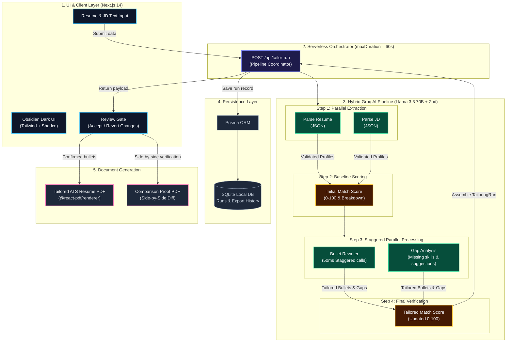
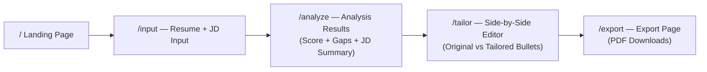
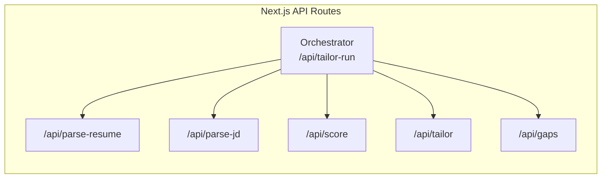
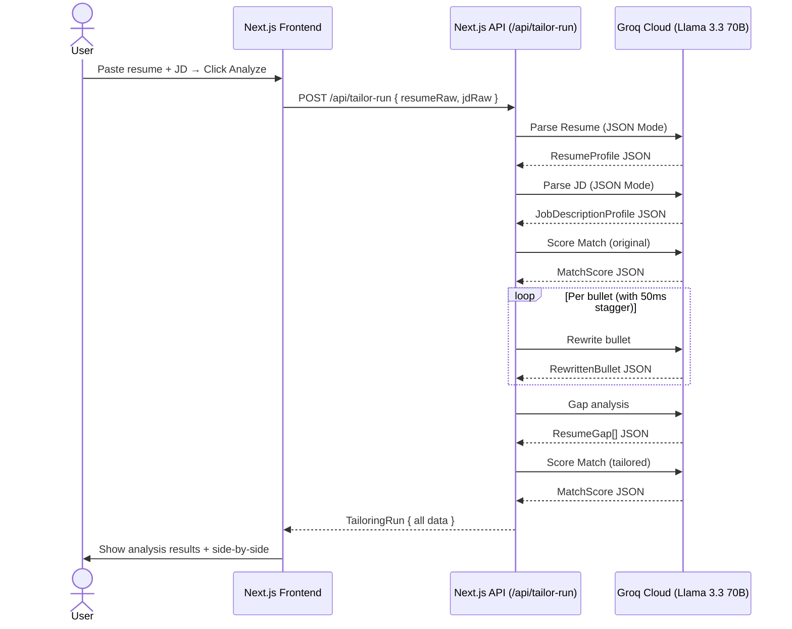

# Resume Shapeshifter — System Architecture

> **Version:** 1.1 | **Date:** September 2026 | **Stack:** Next.js · Groq (Llama 3.3 70B) · React PDF

---

## Table of Contents

1. [System Overview](#1-system-overview)
2. [High-Level Architecture Diagram](#2-high-level-architecture-diagram)
3. [Tech Stack](#3-tech-stack)
4. [Frontend Architecture](#4-frontend-architecture)
5. [Backend Architecture](#5-backend-architecture)
6. [LLM Layer](#6-llm-layer)
7. [Data Models & Schemas](#7-data-models--schemas)
8. [API Design](#8-api-design)
9. [Data Flow — End-to-End](#9-data-flow--end-to-end)
10. [Project Directory Structure](#10-project-directory-structure)
11. [Storage Layer](#11-storage-layer)
12. [PDF Generation Strategy](#12-pdf-generation-strategy)
13. [Truthfulness Guardrails](#13-truthfulness-guardrails)
14. [Implementation Phases](#14-implementation-phases)
15. [Risk Register & Mitigations](#15-risk-register--mitigations)

---

## 1. System Overview

**Resume Shapeshifter** is a JD-to-resume tailoring engine. Given a resume and a job description, it:

- **Parses** both inputs into structured JSON.
- **Scores** the current resume match against the JD (0–100, explainable).
- **Rewrites** resume bullets to improve alignment, truthfully.
- **Detects** skill/experience gaps.
- **Generates** a side-by-side comparison PDF as the primary proof artifact.

### Core Principles

| Principle | Description |
|---|---|
| **Truthfulness** | Never fabricate experience, metrics, or certifications. |
| **Explainability** | Every score and rewrite must have a stated reason. |
| **Reviewability** | Users confirm changes before export. |
| **Portability** | MVP exports to PDF; later to DOCX and Markdown. |

---

## 2. High-Level Architecture Diagram



---

## 3. Tech Stack

### 3.1 Frontend

| Technology | Role | Rationale |
|---|---|---|
| **Next.js 14** (App Router) | Full-stack framework | SSR + API routes in one repo |
| **React 18** | UI component library | Component model, concurrent features |
| **TypeScript** | Type safety | Schema enforcement at compile time |
| **Tailwind CSS** | Styling | Rapid, consistent utility-first design |
| **Shadcn UI** | Component library | Accessible, composable, Tailwind-native |
| **Zod** | Runtime schema validation | Validates every LLM JSON output |
| **React PDF (`@react-pdf/renderer`)** | In-browser PDF rendering | Client-side tailored resume PDF |

### 3.2 Backend

| Technology | Role | Rationale |
|---|---|---|
| **Next.js API Routes** | Orchestration layer | Unified deployment; handles all LLM orchestration natively |
| **Zod** | Schema validation | Native TypeScript runtime validation ensuring strict JSON structure |
| **React PDF (`@react-pdf/renderer`)** | Client-side PDF Generation | Generates both ATS resume and comparison reports without Python dependencies |

### 3.3 LLM & AI

| Technology | Role |
|---|---|
| **Groq Cloud** (`groq-sdk`) | High-speed inference engine (~1200 tok/s) |
| **Llama 3.3 70B Versatile** | JD extraction, scoring, bullet rewriting, gap analysis |
| **JSON mode** (`response_format: { type: "json_object" }`) | Enforce JSON output from every prompt |
| **Separate prompt files** | One file per concern, versioned independently |

> **Why Groq over OpenAI?** Groq's LPU hardware delivers ~10× faster inference than GPU-based providers. A full tailoring run with 8–12 bullets completes in seconds rather than 30–60s. The `llama-3.3-70b-versatile` model provides GPT-4-class reasoning at a fraction of the cost, with generous free-tier limits (30 RPM / 15K TPM on free plan).

### 3.4 Storage

| Technology | Role | Phase |
|---|---|---|
| **Session/local state** | MVP in-memory run data | Phase 1–2 |
| **SQLite (via Prisma)** | Local persistent runs | Phase 3+ |
| **Supabase (PostgreSQL)** | Production persistent storage | Phase 5+ |

---

## 4. Frontend Architecture

### 4.1 Screen Map



### 4.2 Component Tree

```
app/
├── page.tsx                    ← Landing Page
├── input/
│   └── page.tsx                ← Resume + JD paste/upload
├── analyze/
│   └── page.tsx                ← Score + JD summary + gaps
├── tailor/
│   └── page.tsx                ← Side-by-side bullet editor
└── export/
    └── page.tsx                ← Export buttons + final preview

components/
├── ResumeInput.tsx             ← Textarea + PDF/DOCX upload
├── JDInput.tsx                 ← Textarea for job description
├── ScoreCard.tsx               ← Original vs tailored score ring
├── JDSummary.tsx               ← Extracted JD requirements display
├── GapAnalysis.tsx             ← Gap list with severity badges
├── SideBySideDiff.tsx          ← Column comparison of bullets
├── BulletCard.tsx              ← Single bullet: original/tailored/reason
├── ConfidenceBadge.tsx         ← High / Medium / Low / Risk indicator
├── PDFExportButton.tsx         ← Triggers PDF generation
└── DisclaimerBanner.tsx        ← Truthfulness disclaimer
```

### 4.3 State Management

For MVP, **React Context + `useReducer`** is sufficient. The single global state shape:

```typescript
interface AppState {
  resume: ResumeProfile | null;
  jd: JobDescriptionProfile | null;
  matchScore: MatchScore | null;
  tailoredResume: TailoredResume | null;
  gaps: ResumeGap[];
  tailoringRun: TailoringRun | null;
  status: "idle" | "parsing" | "scoring" | "tailoring" | "done" | "error";
}
```

---

## 5. Backend Architecture

### 5.1 Service Responsibilities



### 5.2 Orchestration Flow (Single Run)

The `/api/tailor-run` Next.js route acts as the orchestrator for a complete tailoring run:

1. **Receive** `{ resumeRaw, jdRaw }` from client.
2. **Call internally** parsing logic → `ResumeProfile` & `JobDescriptionProfile`
3. **Call internally** scoring logic → `MatchScore` (original)
4. **Call internally** tailoring logic → `TailoredResume`
5. **Call internally** gap logic → `ResumeGap[]`
6. **Call internally** scoring logic again → `MatchScore` (tailored)
7. **Assemble** `TailoringRun` and return to client.

### 5.3 LLM Client (lib/groq.ts)

A singleton Groq client is used across all API routes. It features:
- Exponential backoff and 429 rate-limit handling (respecting `Retry-After`).
- `json_object` mode enforcing structured outputs.
- Zod validation with error injection on retry (up to 3 attempts).

---

## 6. LLM Layer

### 6.1 Prompt Strategy

Each concern gets its **own prompt file**, independently testable and versionable.

| Prompt File | Input | Output Schema |
|---|---|---|
| `jd_extraction` | Raw JD text | `JobDescriptionProfile` |
| `resume_parser` | Raw resume text | `ResumeProfile` |
| `match_scoring` | `ResumeProfile` + `JobDescriptionProfile` | `MatchScore` |
| `bullet_rewriter` | Single bullet + JD context | `RewrittenBullet` |
| `gap_analysis` | `ResumeProfile` + `JobDescriptionProfile` | `ResumeGap[]` |
| `resume_assembly` | All tailored parts | Final `TailoredResume` |

### 6.2 Structured Output Pattern

All prompts request **JSON mode** via Groq's OpenAI-compatible API:

```typescript
// lib/groq.ts — server-side only (Next.js API route)
import Groq from "groq-sdk";

const groq = new Groq({ apiKey: process.env.GROQ_API_KEY });

const response = await groq.chat.completions.create({
  model: "llama-3.3-70b-versatile",
  messages: [
    { role: "system", content: SYSTEM_PROMPT },
    { role: "user", content: userPrompt },
  ],
  response_format: { type: "json_object" },
  temperature: 0.2,
});

const parsed = JSON.parse(response.choices[0].message.content!);
const validated = SomeZodSchema.parse(parsed); // Zod runtime validation
```

> **Note:** Groq uses `json_object` mode (not `json_schema`). The LLM is instructed to produce JSON matching a schema described in the system prompt. Zod validates the output on the TypeScript side; invalid responses trigger a retry with the validation error injected into the next attempt.

### 6.3 Mandatory LLM Instructions (All Prompts)

Every system prompt must include:

```
TRUTHFULNESS RULES (Non-negotiable):
- Never invent employers, job titles, or dates.
- Never add certifications or degrees not present in the resume.
- Never add technologies unless they appear in the resume.
- Never fabricate metrics (percentages, dollar amounts, team sizes).
- If unsure, mark output with confidence="low" and riskFlag="verify".
- Keep bullet length appropriate for a resume (1-2 lines max).
- Prefer concrete impact language over buzzwords.
- Do not keyword-stuff. Quality over quantity.
```

### 6.4 Bullet Rewriter — Chain of Thought

The bullet rewriter uses a mini-CoT approach to reduce hallucination risk:

```
Step 1: Identify what the original bullet claims.
Step 2: Identify which JD requirements this bullet can truthfully address.
Step 3: Identify stronger action verbs from the JD domain.
Step 4: Rewrite, preserving all factual claims.
Step 5: Flag any addition that is not directly supported by the original.
Step 6: Assign confidence and riskFlag.
```

---

## 7. Data Models & Schemas

### 7.1 `ResumeProfile`

```typescript
interface ResumeProfile {
  contact: {
    name: string;
    email: string;
    phone?: string;
    location?: string;
    linkedin?: string;
    github?: string;
  };
  summary: string;
  skills: string[];
  experience: ExperienceEntry[];
  projects: ProjectEntry[];
  education: EducationEntry[];
  certifications: string[];
}

interface ExperienceEntry {
  company: string;
  title: string;
  startDate: string;
  endDate: string;            // "Present" if current
  bullets: string[];
}

interface ProjectEntry {
  name: string;
  description: string;
  bullets: string[];
  technologies: string[];
}
```

### 7.2 `JobDescriptionProfile`

```typescript
interface JobDescriptionProfile {
  jobTitle: string;
  company: string;
  requiredSkills: string[];
  preferredSkills: string[];
  responsibilities: string[];
  qualifications: string[];
  tools: string[];
  keywords: string[];
  seniorityLevel: "intern" | "junior" | "mid" | "senior" | "lead" | "principal";
  domainSignals: string[];
  softSkills: string[];
}
```

### 7.3 `MatchScore`

```typescript
interface MatchScore {
  overallScore: number;             // 0–100
  skillCoverageScore: number;
  responsibilityAlignmentScore: number;
  keywordScore: number;
  seniorityScore: number;
  criticalMissingRequirements: string[];
  explanation: string;              // Human-readable summary
}
```

### 7.4 `TailoredResume`

```typescript
interface TailoredResume {
  tailoredSummary: string;
  tailoredSkills: string[];
  tailoredExperience: TailoredExperienceEntry[];
}

interface TailoredExperienceEntry {
  company: string;
  title: string;
  bullets: RewrittenBullet[];
}

interface RewrittenBullet {
  original: string;
  tailored: string;
  changeReason: string;
  keywordsAddressed: string[];
  confidence: "high" | "medium" | "low";
  riskFlag: string;                 // Empty string if no risk
}
```

### 7.5 `ResumeGap`

```typescript
interface ResumeGap {
  name: string;
  importance: "high" | "medium" | "low";
  jdEvidence: string;
  resumeEvidence: string;           // Empty if not present
  suggestedAction: string;
  canSafelyAdd: boolean;
}
```

### 7.6 `TailoringRun`

```typescript
interface TailoringRun {
  id: string;                       // UUID
  createdAt: string;                // ISO timestamp
  resumeProfile: ResumeProfile;
  jdProfile: JobDescriptionProfile;
  originalScore: MatchScore;
  tailoredResume: TailoredResume;
  tailoredScore: MatchScore;
  gaps: ResumeGap[];
  exportedDocuments?: ExportedDocument[];
}

interface ExportedDocument {
  type: "tailored-pdf" | "comparison-pdf" | "markdown" | "docx";
  url: string;
  generatedAt: string;
}
```

---

## 8. API Design

### 8.1 Next.js API Routes

| Method | Route | Description |
|---|---|---|
| `POST` | `/api/tailor-run` | Full orchestrated pipeline — main entry point |
| `POST` | `/api/parse-resume` | Parse resume only |
| `POST` | `/api/parse-jd` | Parse JD only |
| `POST` | `/api/score` | Score resume against JD |
| `POST` | `/api/gaps` | Generate gap analysis |
| `POST` | `/api/export-pdf` | Generate and return PDF |
| `GET` | `/api/run/:id` | Retrieve a saved run |

### 8.2 Key Request/Response Shapes

**`POST /api/tailor-run`**
```typescript
// Request
{
  resumeRaw: string;        // Plain text or base64-encoded file
  resumeFormat: "text" | "pdf" | "docx";
  jdRaw: string;            // Plain text JD
}

// Response
{
  run: TailoringRun;
  status: "success" | "partial" | "error";
  errors?: string[];
}
```

**`POST /api/export-pdf`**
```typescript
// Request
{
  runId: string;
  type: "tailored" | "comparison";
}

// Response: PDF binary stream (Content-Type: application/pdf)
```

### 8.3 Internal Routing

All operations previously delegated to Python are now handled by native Next.js API routes under `app/api/`. These routes can be called by the frontend individually or orchestrated via `/api/tailor-run`.

---

## 9. Data Flow — End-to-End



---

## 10. Project Directory Structure

```
resume-shapeshifter/
│
├── app/                            # Next.js App Router
│   ├── layout.tsx
│   ├── page.tsx                    # Landing page
│   ├── input/
│   │   └── page.tsx
│   ├── analyze/
│   │   └── page.tsx
│   ├── tailor/
│   │   └── page.tsx
│   ├── export/
│   │   └── page.tsx
│   └── api/
│       ├── tailor-run/route.ts     # Orchestrator
│       ├── parse-resume/route.ts
│       ├── parse-jd/route.ts
│       ├── score/route.ts
│       ├── gaps/route.ts
│       ├── export-pdf/route.ts
│       └── run/[id]/route.ts
│
├── components/
│   ├── ResumeInput.tsx
│   ├── JDInput.tsx
│   ├── ScoreCard.tsx
│   ├── JDSummary.tsx
│   ├── GapAnalysis.tsx
│   ├── SideBySideDiff.tsx
│   ├── BulletCard.tsx
│   ├── ConfidenceBadge.tsx
│   ├── PDFExportButton.tsx
│   └── DisclaimerBanner.tsx
│
├── lib/
│   ├── schemas.ts                  # All Zod schemas
│   ├── scoring.ts                  # Client-side score display logic
│   ├── pdf.ts                      # React PDF renderer helpers
│   ├── api.ts                      # API call wrappers
│   └── context.tsx                 # AppState context + reducer
│
├── prompts/                        # Frontend-side prompt templates (TS)
│   ├── jd-extraction.ts
│   ├── resume-parser.ts
│   ├── match-scoring.ts
│   ├── bullet-rewriter.ts
│   ├── gap-analysis.ts
│   └── resume-assembly.ts
│
├── types/
│   └── index.ts                    # All TypeScript interfaces
│
│
├── prisma/
│   └── schema.prisma               # DB schema (SQLite/Supabase)
│
├── public/
│   ├── sample-resume.txt           # Demo resume for testing
│   └── sample-jd.txt              # Demo job description
│
├── docs/
│   ├── problemStatement.md
│   └── architecture.md             # This file
│
├── .env.local                      # GROQ_API_KEY, DB_URL
├── next.config.ts
├── tailwind.config.ts
├── tsconfig.json
└── package.json
```

---

## 11. Storage Layer

### 11.1 Database Schema (Prisma)

```prisma
model User {
  id        String   @id @default(cuid())
  createdAt DateTime @default(now())
  runs      TailoringRun[]
}

model TailoringRun {
  id              String   @id @default(cuid())
  createdAt       DateTime @default(now())
  userId          String?
  user            User?    @relation(fields: [userId], references: [id])
  resumeRaw       String
  jdRaw           String
  resumeProfile   Json
  jdProfile       Json
  originalScore   Json
  tailoredResume  Json
  tailoredScore   Json
  gaps            Json
  exports         ExportedDocument[]
}

model ExportedDocument {
  id        String       @id @default(cuid())
  runId     String
  run       TailoringRun @relation(fields: [runId], references: [id])
  type      String       // "tailored-pdf" | "comparison-pdf" | "markdown"
  url       String
  createdAt DateTime     @default(now())
}
```

### 11.2 Storage Strategy by Phase

| Phase | Storage | Why |
|---|---|---|
| 1–2 | React state (in-memory) | No persistence needed for prototype |
| 3–4 | SQLite + Prisma | Local runs persist across sessions |
| 5+ | Supabase (PostgreSQL) | Multi-user, cloud-hosted |

---

## 12. PDF Generation Strategy

### 12.1 Document 1 — Tailored Resume PDF

**Tool:** `@react-pdf/renderer` (client-side React component)

- Rendered as a standard single-column resume.
- Professional layout with sections: Contact, Summary, Skills, Experience, Projects, Education.
- Fully ATS-friendly (no tables, no multi-column, no images).
- Downloadable directly from the browser.

### 12.2 Document 2 — Side-by-Side Comparison PDF

**Tool:** `@react-pdf/renderer` or Browser Print API

Strategy:
1. Client renders a comparison view with two columns: original (left) and tailored (right).
2. Changed bullets are highlighted in the tailored column.
3. Header shows job title, company, original score, and tailored score.
4. Footer includes gap analysis summary and truthfulness disclaimer.
5. The document is generated locally on the client to avoid backend PDF overhead.

### 12.3 Comparison PDF Sections

```
┌──────────────────────────────────────────────────────────────┐
│  RESUME SHAPESHIFTER — Side-by-Side Comparison               │
│  Job: [Job Title] @ [Company]                                │
│  Original Score: 52 → Tailored Score: 78                     │
├──────────────────┬───────────────────────────────────────────┤
│  JD Requirements │  [Extracted skills, responsibilities]      │
├──────────────────┴───────────────────────────────────────────┤
│  ORIGINAL RESUME          │  TAILORED RESUME                 │
│  ─────────────────────   │  ─────────────────────────────   │
│  [bullet text]            │  [rewritten bullet] ★ CHANGED   │
│  [bullet text]            │  [bullet text]                   │
│  ...                      │  ...                             │
├───────────────────────────┴──────────────────────────────────┤
│  GAP ANALYSIS                                                 │
│  ● [High] Missing: Kubernetes experience                     │
│  ● [Med]  Weak: Cloud infrastructure mention                 │
├──────────────────────────────────────────────────────────────┤
│  ⚠️ DISCLAIMER: Verify all content before use. This tool     │
│  does not fabricate experience. Changes are suggestions only. │
└──────────────────────────────────────────────────────────────┘
```

---

## 13. Truthfulness Guardrails

This is a first-class concern, not an afterthought.

### 13.1 What the System Must Never Add

| Category | Prohibited Action |
|---|---|
| Employment | Add companies, titles, or dates not in resume |
| Education | Add degrees, majors, or institutions |
| Certifications | Add certs not listed in resume |
| Technologies | Add tools or languages as "proficient" unless in resume |
| Metrics | Add numbers (%, $, team size) not supported by original |
| Seniority | Inflate leadership scope beyond original implication |

### 13.2 Enforcement Layers

```
Layer 1 — LLM Instructions:  System prompt enforces truthfulness rules.
Layer 2 — JSON Schema:       Zod validates every LLM output natively in TS.
Layer 3 — Risk Flags:        Each RewrittenBullet carries riskFlag + confidence.
Layer 4 — UI Disclosure:     Risk-flagged bullets shown with ⚠️ badge.
Layer 5 — User Review:       User must confirm changes before export.
Layer 6 — PDF Disclaimer:    Both PDFs include a truthfulness disclaimer.
```

### 13.3 `canSafelyAdd` Logic for Gaps

A gap is marked `canSafelyAdd: true` only if:
- The skill is mentioned anywhere in the resume (even implicitly).
- The LLM assigns `confidence: "high"` to the gap suggestion.
- No fabrication of metrics or certifications is required.

---

## 14. Implementation Phases

### Phase 1 — Static Prototype (Week 1)

- [ ] Build input page (paste resume + JD).
- [ ] Mock parsing, scoring, and gap data.
- [ ] Render side-by-side comparison in browser.
- [ ] Basic Tailwind + Shadcn UI design system.

### Phase 2 — LLM Integration (Week 2)

- [ ] Next.js API route orchestration (`/api/tailor-run`).
- [ ] Groq client wrapper (`lib/groq.ts`) with retry and backoff.
- [ ] Zod validation schemas (`lib/schemas.ts`).
- [ ] JD extraction prompt → `JobDescriptionProfile`.
- [ ] Resume parser prompt → `ResumeProfile`.
- [ ] Match scoring prompt → `MatchScore`.
- [ ] Bullet rewriter prompt → `TailoredResume`.
- [ ] Gap analysis prompt → `ResumeGap[]`.

### Phase 3 — PDF Export (Week 3)

- [ ] Tailored resume PDF with `@react-pdf/renderer`.
- [ ] Comparison PDF with React PDF.
- [ ] Highlighted changed bullets.
- [ ] Gap analysis section in comparison PDF.
- [ ] Download buttons.

### Phase 4 — Guardrails & Validation (Week 4)

- [ ] Risk flag display in side-by-side UI.
- [ ] Confidence badge component.
- [ ] User confirmation flow before export.
- [ ] JSON schema validation with error fallback.
- [ ] Unsupported-claim detection heuristics.

### Phase 5 — Polish & Demo Readiness (Week 5)

- [ ] Sample resume + JD preloaded for demo.
- [ ] Loading states and skeleton UI.
- [ ] Error handling and retry logic.
- [ ] SQLite persistence for runs.
- [ ] Responsive UI.
- [ ] Truthfulness disclaimer banner.
- [ ] Final PDF polish.

---

## 15. Risk Register & Mitigations

### 15.1 Parsing Risks

| Risk | Likelihood | Mitigation |
|---|---|---|
| Multi-column PDF parses out of order | High | Warn users; recommend plain text for MVP |
| Non-standard section headers | Medium | LLM-based fallback section classifier |

### 15.2 LLM Risks

| Risk | Likelihood | Mitigation |
|---|---|---|
| Model adds unsupported keywords | High | Truthfulness system prompt + risk flag output field |
| Inconsistent JSON output | Medium | Strict `json_schema` mode + Zod retry with error feedback |
| Score appears more precise than it is | High | UI shows score as a range, not a single integer |
| Bullet becomes longer than resume-appropriate | Medium | Max token constraint + post-process length check |

### 15.3 Product Risks

| Risk | Likelihood | Mitigation |
|---|---|---|
| User trusts output without review | High | Mandatory review step + PDF disclaimer |
| User expects ATS rank guarantee | Medium | Clear copy: "improves alignment, not ATS rank" |
| Vague JD produces poor results | Medium | JD quality warning if extracted skills < 5 |

### 15.4 Technical Risks

| Risk | Likelihood | Mitigation |
|---|---|---|
| Groq rate limits during demo | Medium | Free tier: 30 RPM / 15K TPM. Add delay between bullet requests; retry with backoff |
| Vercel Serverless timeout | Medium | Orchestration route may hit 15s/60s limits. Use Edge API routes or stream if needed |

---

## Appendix A — Environment Variables

```bash
# .env.local
GROQ_API_KEY=gsk_...                   # Groq Cloud API key
DATABASE_URL=file:./dev.db             # SQLite (dev)
NEXT_PUBLIC_APP_URL=http://localhost:3000
```

## Appendix B — Key Design Decisions

| Decision | Choice | Rationale |
|---|---|---|
| Frontend framework | Next.js 14 (App Router) | Unified API routes + SSR |
| Separate Python service | No | Minimized complexity, pure Node.js/TS architecture |
| LLM provider | Groq Cloud (Llama 3.3 70B) | ~10× faster inference, generous free tier, GPT-4-class quality |
| LLM structured output | Groq `json_object` mode + Zod validation | JSON mode + runtime schema enforcement |
| PDF for comparison | React PDF | Client-side generation, no backend headless browser required |
| PDF for tailored resume | React PDF | Browser-side, no server needed |
| State management | Context + useReducer | Simple enough for MVP, no Redux overhead |
| Database | SQLite → Supabase | Start local, migrate to cloud when needed |
| Validation | Zod (TS) | Runtime safety at the Next.js API boundary |

---

*This document covers the full system architecture for Resume Shapeshifter MVP. It should be updated at the start of each implementation phase.*
