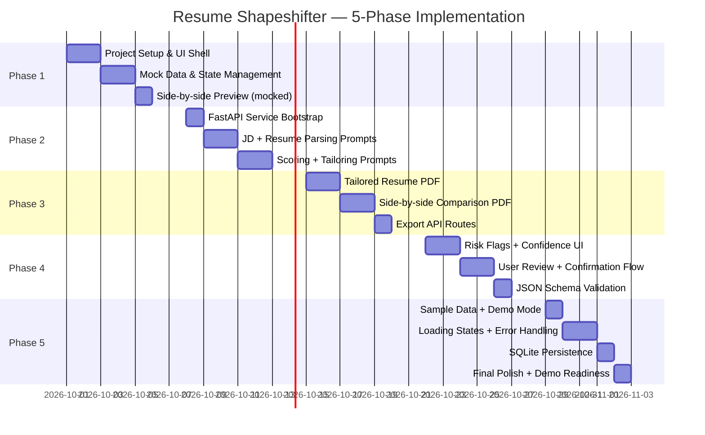
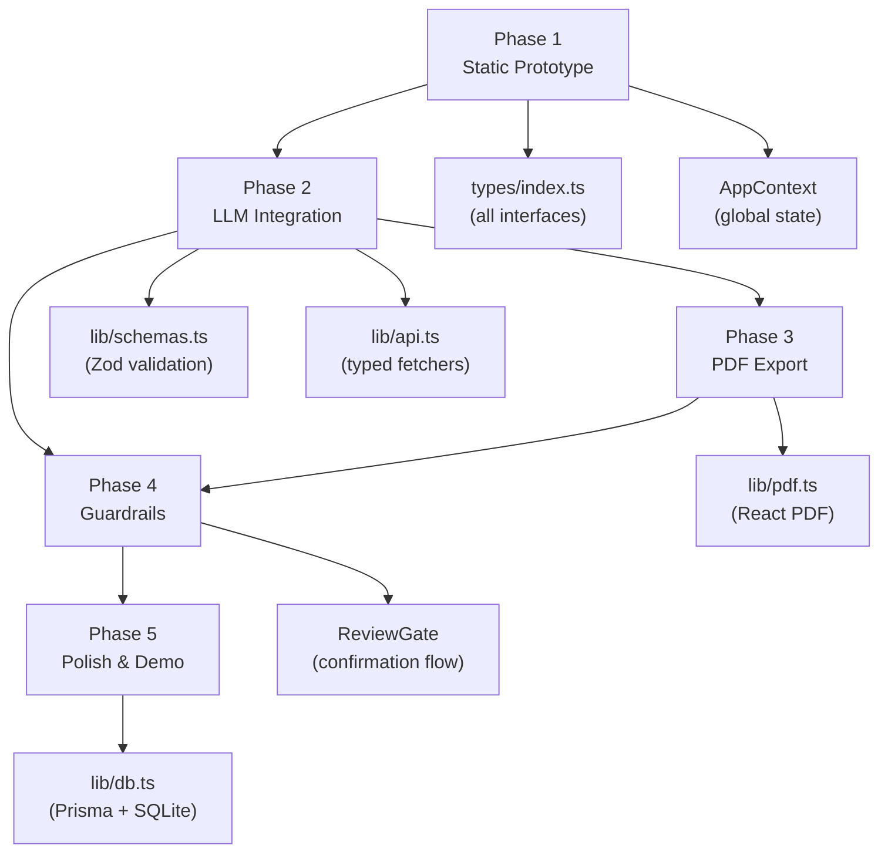

# Resume Shapeshifter — Phase-wise Implementation Plan

> **Based on:** `docs/architecture.md`
> **Total Duration:** 5 Weeks | **Stack:** Next.js 14 · FastAPI · OpenAI · React PDF · Playwright

---

## Overview



---

## Phase 1 — Static Prototype

> **Goal:** A working UI shell with mocked data. No LLM calls. Establish design system and component architecture.
> **Duration:** Week 1 (Days 1–5)

### Day 1–2: Project Setup & Design System

**Objective:** Scaffolded Next.js project with Tailwind + Shadcn, global layout, and design tokens.

**Tasks:**

- [ ] Initialize Next.js 14 project with TypeScript and App Router
  ```bash
  npx create-next-app@latest resume-shapeshifter \
    --typescript --tailwind --eslint --app --src-dir=false
  ```
- [ ] Install Shadcn UI and initialize
  ```bash
  npx shadcn-ui@latest init
  npx shadcn-ui@latest add button input textarea card badge progress separator
  ```
- [ ] Create `types/index.ts` — define all TypeScript interfaces:
  - `ResumeProfile`, `ExperienceEntry`, `ProjectEntry`
  - `JobDescriptionProfile`
  - `MatchScore`
  - `RewrittenBullet`, `TailoredExperienceEntry`, `TailoredResume`
  - `ResumeGap`
  - `TailoringRun`, `ExportedDocument`
  - `AppState`, `AppAction`
- [ ] Create `lib/context.tsx` — `AppContext` with `useReducer` for global state
- [ ] Create `lib/mock-data.ts` — realistic mock `TailoringRun` object for development
- [ ] Set up Google Fonts (Inter or Outfit) in `app/layout.tsx`
- [ ] Create `app/globals.css` with design tokens (colors, spacing, radius)

**Files to Create:**
```
types/index.ts
lib/context.tsx
lib/mock-data.ts
app/layout.tsx
app/globals.css
```

**Acceptance Criteria:**
- [ ] `npm run dev` starts without errors
- [ ] Design tokens defined (primary, accent, background, muted colors)
- [ ] `AppContext` wraps the app and is accessible from any component

---

### Day 2–3: Core Components

**Objective:** Build all UI components in isolation using mock data.

**Tasks:**

- [ ] `components/ResumeInput.tsx`
  - Textarea for plain text paste
  - File upload button (accept `.pdf`, `.docx`, `.txt`)
  - Character count display
  - Clear button
- [ ] `components/JDInput.tsx`
  - Textarea for JD paste
  - Optional URL input field (non-functional in Phase 1)
  - Paste example button (loads mock JD)
- [ ] `components/ScoreCard.tsx`
  - Circular progress ring (SVG or CSS)
  - "Before" and "After" score display
  - Short explanation text below score
  - Animated score counter
- [ ] `components/JDSummary.tsx`
  - Display extracted job title, company, seniority
  - Tag cloud for required skills, preferred skills, tools
  - Responsibilities list
- [ ] `components/ConfidenceBadge.tsx`
  - Color-coded badge: `high` (green), `medium` (amber), `low` (red)
  - Risk flag warning icon when `riskFlag` is non-empty
- [ ] `components/BulletCard.tsx`
  - Side-by-side: original bullet (left) vs tailored bullet (right)
  - Change reason expandable section
  - `ConfidenceBadge` embedded
  - Keywords addressed as chips
- [ ] `components/SideBySideDiff.tsx`
  - Renders `TailoredExperienceEntry[]` as `BulletCard` list
  - Groups by company/role
  - Unchanged bullets shown in muted style
- [ ] `components/GapAnalysis.tsx`
  - List of gaps with importance badge (High / Medium / Low)
  - JD evidence snippet
  - Suggested action text
  - `canSafelyAdd` indicator
- [ ] `components/DisclaimerBanner.tsx`
  - Non-dismissible warning banner
  - "All suggestions must be verified before use"
- [ ] `components/PDFExportButton.tsx`
  - Two buttons: "Export Tailored Resume" and "Export Comparison PDF"
  - Disabled state while loading

**Files to Create:**
```
components/ResumeInput.tsx
components/JDInput.tsx
components/ScoreCard.tsx
components/JDSummary.tsx
components/ConfidenceBadge.tsx
components/BulletCard.tsx
components/SideBySideDiff.tsx
components/GapAnalysis.tsx
components/DisclaimerBanner.tsx
components/PDFExportButton.tsx
```

**Acceptance Criteria:**
- [ ] All components render without errors using mock data
- [ ] `ScoreCard` shows animated score ring
- [ ] `BulletCard` shows original vs tailored with confidence badge
- [ ] `GapAnalysis` shows importance-sorted gap list

---

### Day 4–5: Pages & Navigation

**Objective:** Wire pages together with mock data and navigation.

**Tasks:**

- [ ] `app/page.tsx` — Landing page
  - Hero section: product name, one-line description
  - "Get Started" CTA button → `/input`
  - 3-step feature summary (Input → Analyze → Export)
- [ ] `app/input/page.tsx` — Resume + JD Input page
  - `ResumeInput` + `JDInput` side by side
  - "Analyze" button → navigates to `/analyze` (uses mock data)
  - `DisclaimerBanner` at bottom
- [ ] `app/analyze/page.tsx` — Analysis results page
  - `ScoreCard` (original score from mock)
  - `JDSummary` (mock JD profile)
  - `GapAnalysis` (mock gaps)
  - "Generate Tailored Resume" button → `/tailor`
- [ ] `app/tailor/page.tsx` — Side-by-side editor page
  - `ScoreCard` (before + after from mock)
  - `SideBySideDiff` (mock tailored bullets)
  - "Proceed to Export" button → `/export`
- [ ] `app/export/page.tsx` — Export page
  - Final score summary
  - `PDFExportButton` (non-functional, shows toast)
  - `DisclaimerBanner`

**Files to Create:**
```
app/page.tsx
app/input/page.tsx
app/analyze/page.tsx
app/tailor/page.tsx
app/export/page.tsx
```

**Acceptance Criteria:**
- [ ] Full navigation flow works end-to-end with mock data
- [ ] All pages are responsive (mobile + desktop)
- [ ] No TypeScript errors (`npm run build` passes)

---

### Phase 1 Deliverables

| Deliverable | Status |
|---|---|
| Next.js project scaffolded | ☐ |
| All TypeScript interfaces defined | ☐ |
| All UI components built | ☐ |
| All 5 pages wired with navigation | ☐ |
| Mock data drives full flow | ☐ |
| Design system established | ☐ |

---

## Phase 2 — LLM Integration

> **Goal:** Replace all mock data with real LLM-powered outputs via FastAPI + OpenAI. Five prompt files, five API routes.
> **Duration:** Week 2 (Days 6–10)

### Day 6: FastAPI Service Bootstrap

**Objective:** Running Python service with health check and OpenAI client.

**Tasks:**

- [ ] Create `backend/` directory with virtual environment
  ```bash
  cd backend && python -m venv venv && source venv/bin/activate
  pip install fastapi uvicorn openai pydantic pdf2image pdfminer.six \
              mammoth python-docx playwright
  playwright install chromium
  ```
- [ ] Create `backend/requirements.txt`
- [ ] Create `backend/main.py` — FastAPI app with CORS for `localhost:3000`
- [ ] Create `backend/utils/openai_client.py` — wrapper around `client.chat.completions.create` with:
  - Strict JSON schema mode (`response_format: json_schema`)
  - Retry logic (3 attempts with exponential backoff)
  - Logging of raw LLM response
- [ ] Create `backend/utils/json_validator.py` — validates LLM JSON against Pydantic model, raises `ValidationError` on failure
- [ ] Create `backend/utils/text_utils.py` — text normalization helpers
- [ ] Add `.env` support via `python-dotenv`
- [ ] Create health check route: `GET /health`

**Files to Create:**
```
backend/main.py
backend/requirements.txt
backend/utils/openai_client.py
backend/utils/json_validator.py
backend/utils/text_utils.py
backend/.env
```

**Acceptance Criteria:**
- [ ] `uvicorn main:app --reload` starts on `localhost:8000`
- [ ] `GET /health` returns `{"status": "ok"}`
- [ ] OpenAI client successfully makes a test call

---

### Day 7–8: Parsing Prompts (Resume + JD)

**Objective:** Real parsing of resume and JD text into structured JSON.

**Tasks:**

- [ ] Create `backend/schemas/resume.py` — Pydantic models for `ResumeProfile`, `ExperienceEntry`, `ProjectEntry`, `EducationEntry`
- [ ] Create `backend/schemas/jd.py` — Pydantic models for `JobDescriptionProfile`
- [ ] Create `backend/prompts/resume_parser.py`:
  ```python
  SYSTEM_PROMPT = """
  You are a resume parser. Convert raw resume text into structured JSON.
  Rules:
  - Extract all sections exactly as written. Do not infer or add information.
  - Preserve all bullet points word-for-word.
  - If a section is missing, use an empty list or empty string.
  - Output only valid JSON matching the provided schema.
  """
  ```
- [ ] Create `backend/prompts/jd_extraction.py`:
  ```python
  SYSTEM_PROMPT = """
  You are a job description analyst. Extract structured requirements from a JD.
  Rules:
  - Distinguish required vs preferred skills carefully.
  - Infer seniority level from title and qualifications (intern/junior/mid/senior/lead/principal).
  - Extract all technologies, tools, and platforms mentioned.
  - Output only valid JSON matching the provided schema.
  """
  ```
- [ ] Create `backend/services/resume_parser.py`:
  - `parse_text(text: str) -> ResumeProfile` — LLM-based parsing
  - `parse_pdf(file_bytes: bytes) -> str` — extract text via `pdfminer.six`
  - `parse_docx(file_bytes: bytes) -> str` — extract text via `mammoth`
- [ ] Create `backend/services/jd_parser.py`:
  - `parse_jd(text: str) -> JobDescriptionProfile`
- [ ] Create `backend/routers/parse.py`:
  - `POST /parse/resume` — accepts `{ text: str, format: str }` or file bytes
  - `POST /parse/jd` — accepts `{ text: str }`
- [ ] Wire up Next.js API routes:
  - `app/api/parse-resume/route.ts` → calls `POST http://localhost:8000/parse/resume`
  - `app/api/parse-jd/route.ts` → calls `POST http://localhost:8000/parse/jd`

**Files to Create:**
```
backend/schemas/resume.py
backend/schemas/jd.py
backend/prompts/resume_parser.py
backend/prompts/jd_extraction.py
backend/services/resume_parser.py
backend/services/jd_parser.py
backend/routers/parse.py
app/api/parse-resume/route.ts
app/api/parse-jd/route.ts
```

**Acceptance Criteria:**
- [ ] `POST /parse/resume` returns valid `ResumeProfile` JSON
- [ ] `POST /parse/jd` returns valid `JobDescriptionProfile` JSON
- [ ] Pydantic validation rejects malformed LLM output
- [ ] PDF and DOCX text extraction works for simple single-column resumes

---

### Day 8–9: Scoring + Tailoring + Gap Prompts

**Objective:** Full LLM pipeline — match scoring, bullet rewriting, and gap analysis.

**Tasks:**

- [ ] Create `backend/schemas/scoring.py` — `MatchScore` Pydantic model
- [ ] Create `backend/schemas/tailoring.py` — `RewrittenBullet`, `TailoredExperienceEntry`, `TailoredResume`
- [ ] Create `backend/schemas/gaps.py` — `ResumeGap`
- [ ] Create `backend/prompts/match_scoring.py`:
  - System prompt enforcing scoring dimensions (skill coverage, keyword match, seniority, responsibility alignment)
  - Include truthfulness disclaimer in system prompt
- [ ] Create `backend/prompts/bullet_rewriter.py`:
  - Chain-of-thought: analyze → identify JD alignment → rewrite → flag risk
  - System prompt with hard rules: no fabrication, preserve metrics, explain every change
- [ ] Create `backend/prompts/gap_analysis.py`:
  - System prompt: compare JD requirements against resume content
  - Classify each gap as high/medium/low importance
  - Flag `canSafelyAdd` only when supported by resume evidence
- [ ] Create `backend/services/scoring.py` — `score(resume, jd) -> MatchScore`
- [ ] Create `backend/services/tailoring.py`:
  - `tailor_resume(resume, jd) -> TailoredResume`
  - Calls bullet rewriter **per bullet** (parallel where possible)
- [ ] Create `backend/services/gap_analysis.py` — `analyze_gaps(resume, jd) -> list[ResumeGap]`
- [ ] Create `backend/routers/score.py` — `POST /score`
- [ ] Create `backend/routers/tailor.py` — `POST /tailor`
- [ ] Create `backend/routers/gaps.py` — `POST /gaps`
- [ ] Create full **orchestrator**: `app/api/tailor-run/route.ts`
  - Calls parse → score (original) → tailor → gaps → score (tailored)
  - Assembles `TailoringRun` object
  - Returns to client in single response
- [ ] Wire `/input` page to call real API instead of mock data

**Files to Create:**
```
backend/schemas/scoring.py
backend/schemas/tailoring.py
backend/schemas/gaps.py
backend/prompts/match_scoring.py
backend/prompts/bullet_rewriter.py
backend/prompts/gap_analysis.py
backend/services/scoring.py
backend/services/tailoring.py
backend/services/gap_analysis.py
backend/routers/score.py
backend/routers/tailor.py
backend/routers/gaps.py
app/api/tailor-run/route.ts
```

**Acceptance Criteria:**
- [ ] Full pipeline returns real `TailoringRun` from pasted text
- [ ] Match score changes meaningfully between original and tailored
- [ ] Bullet rewrites are grounded in original resume content
- [ ] Gap list includes actionable suggestions
- [ ] Zod validates every API response on the frontend

---

### Day 10: Prompt Files & Zod Schemas (Frontend)

**Objective:** Frontend-side Zod schemas validate all incoming API data. Prompt files stored in `/prompts/`.

**Tasks:**

- [ ] Create `lib/schemas.ts` — Zod schemas matching every TypeScript interface:
  - `ResumeProfileSchema`, `JobDescriptionProfileSchema`
  - `MatchScoreSchema`, `TailoredResumeSchema`
  - `ResumeGapSchema`, `TailoringRunSchema`
- [ ] Create `prompts/` directory with TS prompt template strings:
  - `prompts/jd-extraction.ts`
  - `prompts/resume-parser.ts`
  - `prompts/match-scoring.ts`
  - `prompts/bullet-rewriter.ts`
  - `prompts/gap-analysis.ts`
- [ ] Create `lib/api.ts` — typed fetch wrappers for all API routes with Zod parse on response
- [ ] Add `.env.local` with `OPENAI_API_KEY` and `PYTHON_API_URL`

**Files to Create:**
```
lib/schemas.ts
lib/api.ts
prompts/jd-extraction.ts
prompts/resume-parser.ts
prompts/match-scoring.ts
prompts/bullet-rewriter.ts
prompts/gap-analysis.ts
.env.local
```

**Acceptance Criteria:**
- [ ] Invalid LLM JSON is caught by Zod before reaching any component
- [ ] All API calls use typed wrappers from `lib/api.ts`
- [ ] `AppContext` updates correctly after real API call

---

### Phase 2 Deliverables

| Deliverable | Status |
|---|---|
| FastAPI service running on `:8000` | ☐ |
| 5 LLM prompt files created | ☐ |
| Resume + JD parsing working | ☐ |
| Match scoring returns 0–100 with explanation | ☐ |
| Bullet rewriting preserves truthfulness | ☐ |
| Gap analysis returns actionable gaps | ☐ |
| Full pipeline: input → `TailoringRun` | ☐ |
| Zod validation on all API responses | ☐ |

---

## Phase 3 — PDF Export

> **Goal:** Two downloadable PDFs — a clean tailored resume and a full side-by-side comparison proof artifact.
> **Duration:** Week 3 (Days 11–15)

### Day 11–12: Tailored Resume PDF

**Objective:** Browser-renderable PDF of the tailored resume using `@react-pdf/renderer`.

**Tasks:**

- [ ] Install `@react-pdf/renderer`
  ```bash
  npm install @react-pdf/renderer
  ```
- [ ] Create `lib/pdf.ts` — PDF helper utilities (font registration, style constants)
- [ ] Create `components/pdf/TailoredResumePDF.tsx`:
  - Takes `TailoringRun` as prop
  - Sections: Contact, Summary, Skills, Experience (tailored bullets), Projects, Education, Certifications
  - Clean single-column ATS-friendly layout
  - No tables, no images, no multi-column
  - Font: Helvetica or registered custom font (e.g., Inter via `Font.register`)
- [ ] Register font in `lib/pdf.ts`:
  ```typescript
  Font.register({
    family: 'Inter',
    src: 'https://fonts.gstatic.com/s/inter/v13/...'
  });
  ```
- [ ] Add `PDFDownloadLink` to `components/PDFExportButton.tsx` for tailored resume
- [ ] Test with mock `TailoringRun` data first, then real data

**Files to Create/Update:**
```
lib/pdf.ts
components/pdf/TailoredResumePDF.tsx
components/PDFExportButton.tsx  ← update to wire real download
```

**Acceptance Criteria:**
- [ ] "Export Tailored Resume" downloads a valid PDF
- [ ] PDF contains all tailored bullets (not originals)
- [ ] PDF is single-column and readable
- [ ] Contact info, all sections present

---

### Day 12–14: Side-by-Side Comparison PDF

**Objective:** Server-rendered Playwright PDF showing original vs tailored content with all metadata.

**Tasks:**

- [ ] Create `backend/services/pdf_generator.py`:
  - Accepts full `TailoringRun` JSON
  - Renders an HTML template using Jinja2
  - Launches Playwright headless Chromium
  - Returns PDF bytes via `page.pdf(format="A4", print_background=True)`
- [ ] Create `backend/templates/comparison.html.j2` — Jinja2 HTML template:
  - Header: job title, company, original score, tailored score
  - JD requirements summary section
  - Two-column table: original bullets (left) vs tailored bullets (right)
  - Changed bullets highlighted with background color
  - Gap analysis section at bottom
  - Truthfulness disclaimer footer
- [ ] Create `backend/routers/export.py`:
  - `POST /export/comparison-pdf` — returns `Response(content=pdf_bytes, media_type="application/pdf")`
- [ ] Install Jinja2: `pip install jinja2`
- [ ] Create `app/api/export-pdf/route.ts`:
  - Calls `POST http://localhost:8000/export/comparison-pdf`
  - Streams PDF bytes back to browser
- [ ] Update `PDFExportButton.tsx` — wire "Export Comparison PDF" button to `/api/export-pdf`

**Files to Create:**
```
backend/services/pdf_generator.py
backend/templates/comparison.html.j2
backend/routers/export.py
app/api/export-pdf/route.ts
```

**Acceptance Criteria:**
- [ ] "Export Comparison PDF" downloads a valid PDF
- [ ] PDF shows original and tailored bullets in two columns
- [ ] Changed bullets are visually highlighted
- [ ] Match scores (before + after) visible in PDF header
- [ ] Gap analysis section present
- [ ] Disclaimer present in footer

---

### Day 15: Export Page Polish

**Objective:** Export page shows full summary and download options with correct states.

**Tasks:**

- [ ] Update `app/export/page.tsx`:
  - Show final `ScoreCard` (before + after)
  - Show `GapAnalysis` summary (high-importance gaps only)
  - Two download buttons (tailored PDF, comparison PDF)
  - Loading spinner during PDF generation
  - Success toast after download
  - `DisclaimerBanner` prominently displayed
- [ ] Add loading state to `PDFExportButton` (disabled + spinner during generation)
- [ ] Add error handling: show error toast if PDF generation fails

**Acceptance Criteria:**
- [ ] Both PDFs download correctly from export page
- [ ] Loading states are visible
- [ ] Error states are handled gracefully

---

### Phase 3 Deliverables

| Deliverable | Status |
|---|---|
| Tailored resume PDF (React PDF) | ☐ |
| Side-by-side comparison PDF (Playwright) | ☐ |
| Changed bullets highlighted in PDF | ☐ |
| Scores in PDF header | ☐ |
| Gap analysis in PDF | ☐ |
| Disclaimer in PDF footer | ☐ |
| Both PDFs downloadable from export page | ☐ |

---

## Phase 4 — Guardrails & Validation

> **Goal:** Enforce truthfulness at every layer. Users must review and confirm changes before export. No silent failures.
> **Duration:** Week 4 (Days 16–20)

### Day 16–17: Risk Flags + Confidence UI

**Objective:** Every rewritten bullet displays its confidence level and risk flag clearly in the UI.

**Tasks:**

- [ ] Update `ConfidenceBadge.tsx`:
  - `high` → green badge
  - `medium` → amber badge
  - `low` → red badge
  - Non-empty `riskFlag` → ⚠️ warning icon with tooltip showing risk text
- [ ] Update `BulletCard.tsx`:
  - Show `ConfidenceBadge` prominently
  - If `riskFlag` is non-empty, highlight card border in amber
  - Show `riskFlag` text in expandable warning section
  - Show keywords addressed as color-coded chips
  - Show `changeReason` in collapsible section
- [ ] Add filter controls to `SideBySideDiff.tsx`:
  - Filter by confidence: "All" / "High only" / "Show risks"
  - Filter by company/role
- [ ] Add aggregate risk summary to `app/tailor/page.tsx`:
  - "X bullets have risk flags — please review before export"
  - Count of high/medium/low confidence rewrites
- [ ] Update `GapAnalysis.tsx`:
  - `canSafelyAdd: false` gaps shown with 🚫 icon
  - Tooltip: "Do not add this if not true"
  - `canSafelyAdd: true` gaps shown with ✅ icon

**Files to Update:**
```
components/ConfidenceBadge.tsx
components/BulletCard.tsx
components/SideBySideDiff.tsx
components/GapAnalysis.tsx
app/tailor/page.tsx
```

**Acceptance Criteria:**
- [ ] Every bullet shows confidence badge
- [ ] Risk-flagged bullets are visually distinct
- [ ] Filter controls work correctly
- [ ] Gap `canSafelyAdd` state is clearly communicated

---

### Day 17–18: User Review & Confirmation Flow

**Objective:** Users must acknowledge risk flags before they can export.

**Tasks:**

- [ ] Add `confirmed` boolean field to `RewrittenBullet` state (client-side only)
- [ ] Update `BulletCard.tsx`:
  - Add "Accept Change" / "Revert to Original" toggle per bullet
  - Reverted bullets use original text in export
- [ ] Create `components/ReviewGate.tsx`:
  - Shown on export page if any risk-flagged bullets are unreviewed
  - "You have X unreviewed risk flags. Please review before exporting."
  - Lists unreviewed bullets with links to tailor page
  - "I have reviewed all changes" checkbox → unlocks export buttons
- [ ] Update `app/export/page.tsx`:
  - Wrap export buttons in `ReviewGate`
  - Export is blocked until `ReviewGate` is cleared
- [ ] Update PDF generation to use confirmed bullets:
  - If user reverted a bullet, use `original` text in PDF
  - If accepted, use `tailored` text

**Files to Create/Update:**
```
components/ReviewGate.tsx
components/BulletCard.tsx      ← add accept/revert toggle
app/export/page.tsx            ← add ReviewGate wrapper
backend/services/pdf_generator.py  ← handle confirmed/reverted bullets
```

**Acceptance Criteria:**
- [ ] Each bullet can be individually accepted or reverted
- [ ] Export is blocked until all risk flags are reviewed
- [ ] Reverted bullets appear as original in exported PDFs
- [ ] "I have reviewed all changes" acknowledgment is required

---

### Day 19–20: JSON Schema Validation & Error Recovery

**Objective:** All LLM outputs are validated. Failures don't crash the app — they retry or degrade gracefully.

**Tasks:**

- [ ] Update `backend/utils/openai_client.py`:
  - On `ValidationError`, retry up to 3 times with error feedback in next prompt
  - Log all raw LLM responses to `backend/logs/`
  - Return structured error on final failure
- [ ] Update `backend/utils/json_validator.py`:
  - Strict Pydantic validation for each schema
  - Custom error messages: "Field `confidence` must be one of: high, medium, low"
- [ ] Update `app/api/tailor-run/route.ts`:
  - Partial success: if scoring fails, return `TailoringRun` without score
  - Partial success: if gap analysis fails, return run without gaps
  - Surface specific error messages to frontend
- [ ] Update `lib/api.ts`:
  - Zod `safeParse` on every response
  - Return `{ success: false, error: string }` on validation failure
- [ ] Update `AppContext` to handle partial states:
  - `status: "partial"` when some pipeline steps failed
  - Show which steps succeeded and which failed
- [ ] Add error UI to each page:
  - Inline error messages in analyze/tailor pages
  - Retry button for failed pipeline steps
- [ ] Create `components/ErrorBanner.tsx` — shows pipeline error with retry option

**Files to Create/Update:**
```
backend/utils/openai_client.py     ← retry logic
backend/utils/json_validator.py    ← strict validation
app/api/tailor-run/route.ts        ← partial success handling
lib/api.ts                         ← Zod safeParse
lib/context.tsx                    ← partial state handling
components/ErrorBanner.tsx
```

**Acceptance Criteria:**
- [ ] LLM validation failures trigger retry (max 3 attempts)
- [ ] App shows meaningful error messages instead of crashing
- [ ] Partial results displayed when only some pipeline steps succeed
- [ ] Retry button allows recovering from transient errors

---

### Phase 4 Deliverables

| Deliverable | Status |
|---|---|
| Confidence badges on every bullet | ☐ |
| Risk-flagged bullets highlighted | ☐ |
| Accept / Revert toggle per bullet | ☐ |
| Export blocked until review complete | ☐ |
| "I reviewed all changes" acknowledgment | ☐ |
| LLM retry on validation failure | ☐ |
| Partial pipeline success handled | ☐ |
| Error banner with retry | ☐ |

---

## Phase 5 — Polish & Demo Readiness

> **Goal:** A polished, shareable demo. Preloaded sample data, smooth UX, persistent storage, and a PDF proof artifact ready to show.
> **Duration:** Week 5 (Days 21–25)

### Day 21: Sample Data & Demo Mode

**Objective:** One-click demo mode loads a realistic sample resume and JD for instant showcase.

**Tasks:**

- [ ] Create `public/sample-resume.txt` — realistic software engineer resume (3 years experience, React/Node/Python)
- [ ] Create `public/sample-jd.txt` — real or realistic senior engineer JD (React, TypeScript, AWS, Docker, CI/CD)
- [ ] Add "Load Sample Data" button to `app/input/page.tsx`:
  - Loads sample resume into `ResumeInput`
  - Loads sample JD into `JDInput`
  - Shows toast: "Sample data loaded — click Analyze to see the full pipeline"
- [ ] Pre-cache a demo `TailoringRun` in `lib/mock-data.ts` (generated from real LLM run) for instant demo without API calls
- [ ] Add `?demo=true` query param support: auto-loads sample + uses cached run

**Files to Create/Update:**
```
public/sample-resume.txt
public/sample-jd.txt
lib/mock-data.ts               ← update with real cached run
app/input/page.tsx             ← add "Load Sample" button
```

**Acceptance Criteria:**
- [ ] "Load Sample Data" populates both inputs in one click
- [ ] `?demo=true` shows full pipeline result instantly
- [ ] Demo data is realistic and produces a meaningful before/after score difference

---

### Day 22–23: Loading States, Animations & Error Handling

**Objective:** The app feels polished and responsive during async operations.

**Tasks:**

- [ ] Create `components/PipelineProgress.tsx`:
  - Shows each pipeline step with status: pending / running / done / failed
  - Steps: Parsing Resume → Parsing JD → Scoring → Tailoring → Gap Analysis → Scoring (tailored)
  - Animated step indicators (spinner → checkmark → error icon)
- [ ] Update `app/analyze/page.tsx` and `app/tailor/page.tsx`:
  - Show `PipelineProgress` while pipeline runs
  - Transition smoothly to results on completion
- [ ] Add skeleton loaders to `ScoreCard`, `GapAnalysis`, `SideBySideDiff`
- [ ] Add page transition animations (Tailwind `animate-in` or Framer Motion)
- [ ] Handle network errors with retry option
- [ ] Show estimated processing time ("This usually takes 15–30 seconds")
- [ ] Add `ErrorBanner` with specific messages for each failure type
- [ ] Add toast notifications:
  - Success: "Analysis complete — 26-point improvement in match score!"
  - Error: "Bullet rewriting failed — retrying..."
  - Warning: "PDF parsing may be imperfect. Verify your parsed resume."

**Files to Create/Update:**
```
components/PipelineProgress.tsx
app/analyze/page.tsx           ← pipeline progress + skeleton
app/tailor/page.tsx            ← skeleton loaders
```

**Acceptance Criteria:**
- [ ] Pipeline progress visible during processing
- [ ] Skeleton loaders prevent layout shift
- [ ] Toast notifications for all key events
- [ ] No unhandled promise rejections in console

---

### Day 23–24: SQLite Persistence

**Objective:** Tailoring runs persist across browser sessions via Prisma + SQLite.

**Tasks:**

- [ ] Install Prisma
  ```bash
  npm install prisma @prisma/client
  npx prisma init --datasource-provider sqlite
  ```
- [ ] Create `prisma/schema.prisma` with `TailoringRun` and `ExportedDocument` models
- [ ] Run migration: `npx prisma migrate dev --name init`
- [ ] Create `lib/db.ts` — Prisma client singleton
- [ ] Update `app/api/tailor-run/route.ts` — save `TailoringRun` to DB after completion
- [ ] Create `app/api/run/[id]/route.ts` — `GET` retrieves saved run by ID
- [ ] Add "History" page stub at `app/history/page.tsx`:
  - List of past runs (job title, company, date, score improvement)
  - Link to revisit any run
- [ ] Update export API to save `ExportedDocument` record after PDF generation
- [ ] Generate run ID and store in URL: `/tailor?runId=abc123`

**Files to Create/Update:**
```
prisma/schema.prisma
lib/db.ts
app/api/run/[id]/route.ts
app/history/page.tsx
```

**Acceptance Criteria:**
- [ ] Completed run is saved to SQLite
- [ ] Run is retrievable by ID (`GET /api/run/:id`)
- [ ] History page shows past runs
- [ ] Page refresh does not lose run data

---

### Day 25: Final Polish & Demo Readiness

**Objective:** The app is ready to demo and share as a portfolio project.

**Tasks:**

- [ ] **Landing page final pass:**
  - Add animated hero with typewriter effect or score counter
  - Add 3 feature cards with icons
  - Add "Try with sample resume" CTA
  - Add footer with disclaimer
- [ ] **PDF final pass:**
  - Review comparison PDF layout for readability
  - Ensure all sections present: header, JD summary, bullets, gaps, disclaimer
  - Test with a real job listing (e.g., from LinkedIn or a company careers page)
- [ ] **SEO + meta:**
  - Add `<title>` and `<meta description>` to all pages
  - Add `og:image` meta tag
  - Add semantic HTML headings hierarchy
- [ ] **Responsive check:**
  - Test all pages at 375px (mobile), 768px (tablet), 1280px (desktop)
  - Fix any layout issues
- [ ] **Accessibility:**
  - All interactive elements have unique IDs
  - All images have `alt` text
  - Color contrast meets WCAG AA
- [ ] **Environment:**
  - Create `.env.example` with all required env vars documented
  - Add `README.md` with setup instructions
- [ ] **Final demo run:**
  - Use real job listing + realistic sample resume
  - Capture before/after scores
  - Export both PDFs
  - Verify comparison PDF is shareable as portfolio artifact

**Files to Create/Update:**
```
app/page.tsx                   ← final landing pass
README.md
.env.example
```

**Acceptance Criteria:**
- [ ] Full demo runs end-to-end without errors
- [ ] Both PDFs export correctly with real data
- [ ] App is mobile-responsive
- [ ] `npm run build` passes with no TypeScript errors
- [ ] README documents setup in under 10 steps

---

### Phase 5 Deliverables

| Deliverable | Status |
|---|---|
| Sample resume + JD preloaded | ☐ |
| Demo mode (`?demo=true`) works | ☐ |
| Pipeline progress UI | ☐ |
| Skeleton loaders + toasts | ☐ |
| SQLite persistence | ☐ |
| History page | ☐ |
| Landing page polished | ☐ |
| Both PDFs production-ready | ☐ |
| Mobile responsive | ☐ |
| README complete | ☐ |

---

## Complete Task Checklist Summary

### Phase 1 — Static Prototype (Week 1)
- [ ] Next.js + Tailwind + Shadcn setup
- [ ] All TypeScript interfaces in `types/index.ts`
- [ ] AppContext + useReducer
- [ ] Mock data
- [ ] All 10 components built
- [ ] All 5 pages wired with navigation

### Phase 2 — LLM Integration (Week 2)
- [ ] FastAPI service running
- [ ] 5 Python prompt files
- [ ] Resume + JD parsing routes
- [ ] Scoring route
- [ ] Tailoring route (per-bullet rewriting)
- [ ] Gap analysis route
- [ ] Full orchestrator `/api/tailor-run`
- [ ] Zod schemas in `lib/schemas.ts`

### Phase 3 — PDF Export (Week 3)
- [ ] Tailored resume PDF (`@react-pdf/renderer`)
- [ ] Comparison PDF (Playwright + Jinja2 HTML template)
- [ ] Export API route
- [ ] Export page wired

### Phase 4 — Guardrails & Validation (Week 4)
- [ ] Confidence badges + risk flag UI
- [ ] Accept / Revert per bullet
- [ ] ReviewGate blocks export
- [ ] LLM retry on validation failure
- [ ] Partial pipeline success handling
- [ ] Error banner + retry

### Phase 5 — Polish & Demo Readiness (Week 5)
- [ ] Sample data + demo mode
- [ ] Pipeline progress component
- [ ] Skeleton loaders + toast notifications
- [ ] SQLite persistence + Prisma
- [ ] History page
- [ ] Landing page final pass
- [ ] SEO meta tags
- [ ] Mobile responsive
- [ ] README

---

## Dependency Map



---

*This implementation plan maps directly to `docs/architecture.md`. Each phase builds on the previous with no dead-end work. Priority is always a working vertical slice.*
